# Project Overview

This project presents a wafer map defect classification system based on deep learning.It combines Convolutional Neural Networks (CNN) and Multi-Layer Perceptrons (MLP), and iteratively improves model performance from model1 to model11.

# Project Structure

VisariLIAO/

├── best_model/              # Trained model files

├── confusion_matrix/        # Confusion matrix related files or charts

├── dataset/                 # Raw or processed datasets

├── model_example/           # Example models or demo scripts

├── .gitignore               # Git ignore configuration file

├── Challenges & Solutions.md # Project challenges and solutions description

├── README.md                # Project documentation

└── requirements.txt         # Project dependency package list

# Dataset

We use the Mixed-type Wafer Defect Dataset (MixedWM38), which contains 38,015 wafer maps of size 52×52 pixels. The dataset includes:

- arr_0: Wafer map data where  
  - 0 = blank spot  
  - 1 = normal die (passed electrical test)  
  - 2 = broken die (failed electrical test)  

- arr_1: One-hot encoded labels representing 8 basic defect types (single defects).
  1.Center
  2.Donut
  3.Edge-Loc
  4.Edge-Ring
  5.Loc
  6.Near-full
  7.Random
  8.Scratch

This is a multi-label classification task, as one wafer map can exhibit multiple defect types simultaneously.

# Problem Definition

- **Task**: Multi-label classification of wafer defects.  
- **Output layer**: 8 neurons with sigmoid activation function.  
- **Loss function**: Binary cross-entropy (`binary_crossentropy`).

---

### 💡 Motivation & Problem Statement 
Wafer defect detection is a critical step in semiconductor manufacturing to ensure product quality and reduce costs. Traditional inspection methods are often time-consuming and subject to human error. This project aims to develop an automated, accurate, and robust multi-label classification system to efficiently identify various defect types on wafer maps, helping manufacturers improve yield and minimize defective products.

---

### 🎯 Why Prioritize High Precision 
In wafer defect detection, **high precision** means predicted defects are very likely true defects, significantly reducing false positives. Excessive false positives lead to unnecessary rework and waste of resources. Therefore, prioritizing precision minimizes unnecessary inspections and interventions, improves production efficiency, and maintains product quality.

# Model Architecture

Hybrid Neural Network Model Architecture and Key Techniques
This project presents an innovative CNN and MLP dual-branch architecture, designed to effectively capture both spatial features and raw data patterns. It integrates various advanced techniques to enhance model performance and robustness.

🏗️ Model Architecture Overview
The model consists of two independent branches: a Convolutional Neural Network (CNN) branch and a Multi-Layer Perceptron (MLP) branch, with their outputs integrated through a fusion layer.

The model consists of two independent branches: a Convolutional Neural Network (CNN) branch and a Multi-Layer Perceptron (MLP) branch, with their outputs integrated through a fusion layer.

### 1. CNN Branch

Dedicated to capturing spatial features and local patterns within the data.

- **Structure:** Comprises 3 convolutional blocks with increasing filters:  
  - Block 1: 64 filters  
  - Block 2: 128 filters  
  - Block 3: 256 filters  
- **Inside each block:**  
  - BatchNormalization: Accelerates training and improves stability  
  - LeakyReLU Activation: Introduces non-linearity and prevents the "dying neuron" problem of ReLU  
  - MaxPooling2D: Downsamples and extracts dominant features  
- **Final Layer:** Dense layer with L2 regularization and Dropout to reduce overfitting

### 2. MLP Branch

Processes raw input data directly to learn low-dimensional or non-spatial patterns.

- **Structure:**  
  - Flatten input data  
  - Dense(512) fully connected layer  
  - Dense(256) fully connected layer  
- **Activation Function:** LeakyReLU for all dense layers

### 3. Fusion Layer

Integrates features extracted from both CNN and MLP branches for final decision making.

- **Operation:** Concatenate feature vectors from CNN and MLP branches  
- **Subsequent layers:**  
  - Dense(256) + Dropout  
  - Dense(8) output layer with Sigmoid activation for multi-label classification

---

## ⚙️ Key Techniques Used
This project employs a range of essential techniques during model development and training to optimize performance, generalization capability, and training efficiency:

| Category               | Techniques                                           | Purpose                                                                                          |
|------------------------|------------------------------------------------------|--------------------------------------------------------------------------------------------------|
| 📈 Feature Extraction | CNN layers with increasing filter sizes              | Effectively capture hierarchical spatial features from input data                                |
| ➕ Dual Path Learning | CNN + MLP branches                                   | Combine spatial features and raw data patterns for comprehensive feature representation          |
| 🧪 Data Augmentation  | Rotation, shift, zoom, horizontal flip               | Increase data diversity, reduce dependency on specific data arrangements, improve generalization |
| 🧹 Regularization     | L2 weight decay and Dropout layers                   | Strongly mitigate overfitting, improve performance on unseen data                                |
| 🧠 Activation         | LeakyReLU activation function                        | Prevent dying neurons, ensure gradient flow, and enhance training stability                      |
| 🛑 Early Stopping     | Stop training when validation loss plateaus          | Prevent overfitting and save training time                                                       |
| 🧪 Validation Strategy| 15% validation split (train_test_split)              | Evaluate model on unseen data during training, monitor overfitting                               |
| 🎯 Loss Function      | Binary Cross-Entropy                                 | Suitable for multi-label classification, quantifies prediction error                             |
| 🧮 Optimizer          | Adam with ReduceLROnPlateau scheduler                | Automatically reduces learning rate when validation metrics plateau, improves convergence        |
| 📏 Thresholding       | Prediction threshold set at 0.9                      | Adjusts strictness in class labeling for multi-label output                                      |
| 📊 Evaluation Metrics | Macro Precision, Recall, F1-score, Subset Accuracy   | Comprehensive evaluation of multi-label classification performance                               |

## Evaluation Metrics

This project addresses a multi-label classification problem where each wafer map may contain multiple defect types. Therefore, a single accuracy metric is insufficient to fully evaluate model performance. We use the following evaluation metrics:

- **Precision**: The ratio of correctly predicted positive observations to the total predicted positives. Indicates the reliability of positive predictions and helps reduce false positives.

- **Recall**: The ratio of correctly predicted positive observations to all actual positives. Reflects the model’s ability to detect positive instances, reducing false negatives.

- **F1-score**: The harmonic mean of Precision and Recall, providing a balance between the two, commonly used in multi-label classification.

- **Sub-accuracy**: The average accuracy calculated per label, measuring the model’s stable performance across each defect type.

All metrics are computed per defect category and averaged (macro or micro averaging) to fairly assess the multi-label classification results.

## 📈 Final Model Performance （model11）

| Metric index       |   Score    |
|--------------------|------------|
| Macro Precision    | **0.9970** |
| Macro Recall       | **0.9646** |
| Macro F1-score     | **0.9792** |
| Subset Accuracy    | **0.9721** |

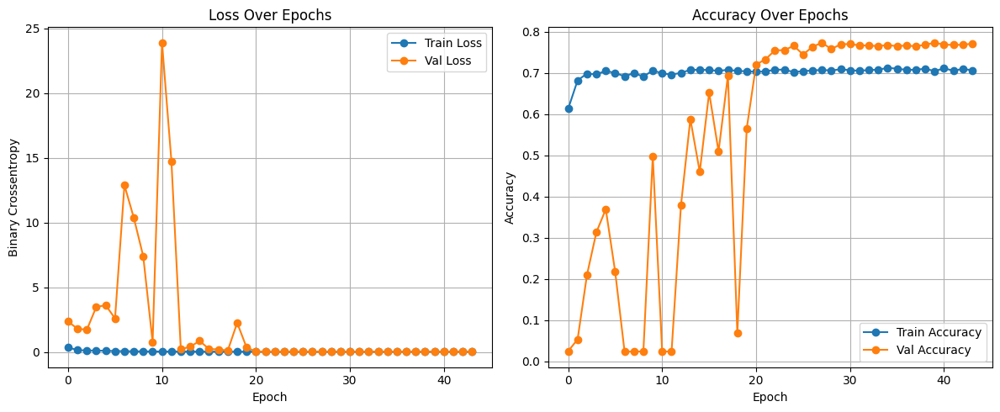

## Visualizations

The following confusion matrices show the classification results of **model11** for the eight wafer defect categories.

1. Center
   
   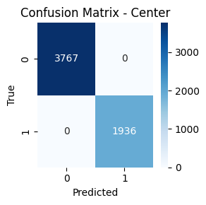

2. Donut
   
   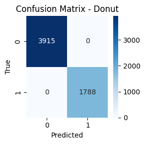

3. Edge-Loc
    
   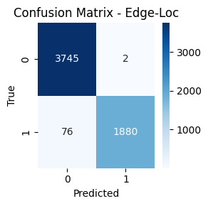

4. Edge-Ring
   
   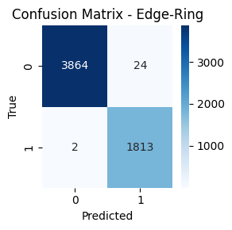

5. Loc
    
   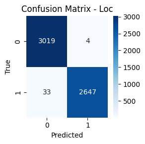

6. Near-full
    
   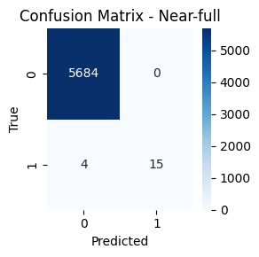

7. Random
    
   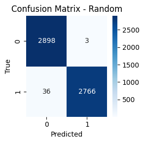
  
8. Scratch
    
   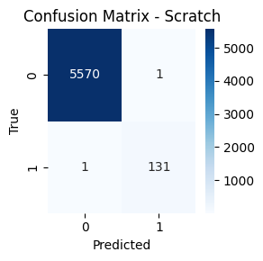

*Note: The images illustrate the predicted defect regions and demonstrate the model's accuracy and robustness in multi-label classification.*

Following these, five examples of actual wafer maps predicted by model11 will be presented to showcase its real-world performance.

  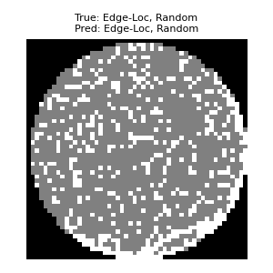 
  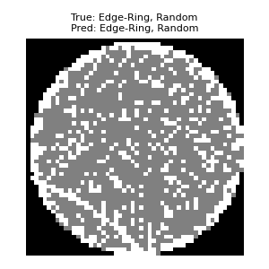
  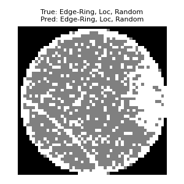
  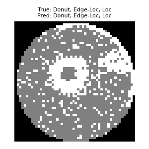
  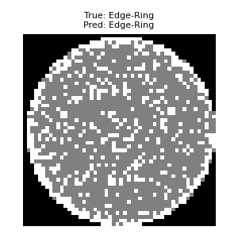

## References

 1. [Defect Pattern Recognition on Wafers Using Convolutional Neural Networks](https://ieeexplore.ieee.org/document/9073738)  
   *Chih-Hsiung Wang, Yu-Chen Chen, 2020*
 2. [A hybrid MLP‑CNN classifier for very fine resolution remotely sensed image classification](https://doi.org/10.1016/j.isprsjprs.2017.07.014)  
  Ce Zhang *et al.*, 2018. 混合 CNN 與 MLP 分支，並以信心驅動融合策略達到最佳分類效果。

 3.- [Development of a Wafer Defect Pattern Classifier Using Ensemble of Binary CNNs](https://www.mdpi.com/2079-9292/13/7/1360)  
  
###  Dataset

We used the [Mixed-type Wafer Defect Dataset (MixedWM38)](https://www.kaggle.com/datasets/shawon10/wafer-map-dataset-mixedwm38) from Kaggle.  
It contains 38,015 labeled wafer maps (size 52×52), with one-hot encoded labels for 8 single-type defects.

> Dataset by [Shawon10](https://www.kaggle.com/shawon10), available under CC BY-NC-SA 4.0 License.

## ✨ Author

* **Visari Liao (Liao,Yun-chen)：** 
* M.S. in Statistics, National Chung Hsing University
* B.S. in Mathematics, National Chung Cheng University
* **Professional Fields**: Data Scientist, AI/Machine Learning, Deep Learning, Algorithm Development
* **Interests**: Deep learning, data science, and AI applications for semiconductor manufacturing.
