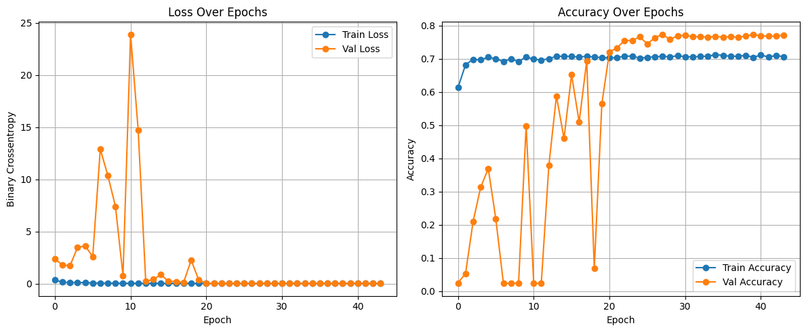
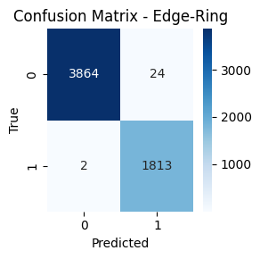
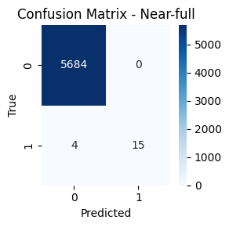
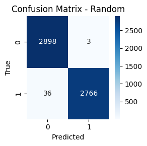
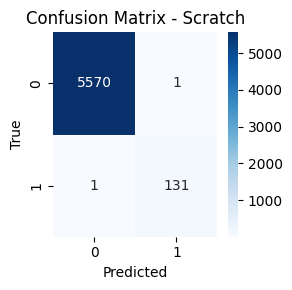
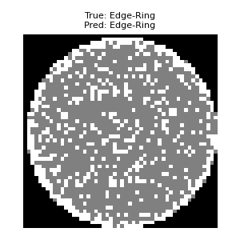

# 專案概述

本專案基於深度學習，提出一套晶圓缺陷圖譜分類系統。在本專案中，我嘗試並比較了多種深度學習模型架構，包括調整 VGG 網路參數、堆疊多層卷積神經網路 (CNN)，逐步演進至結合多層感知器 (MLP) 的混合架構，並引入資料增強技術以提升模型泛化能力。此外，針對訓練流程進行優化，包含調整訓練輪數（epoch）、利用 GPU 加速訓練、採用動態學習率調整策略，並引入提前停止（Early Stopping）機制以避免過擬合。模型從初版的 model1 持續迭代至效果最佳的 model11。詳細的實作細節與改動可參考程式碼。

---

# 專案結構

---

# 資料集

本專案採用 Mixed-type Wafer Defect Dataset（MixedWM38），包含 38,015 張 52×52 像素的晶圓缺陷圖。

- arr_0：晶圓圖數據  
  - 0 = 空白點  
  - 1 = 正常晶粒（通過電性測試）  
  - 2 = 損壞晶粒（未通過電性測試）  

- arr_1：8 種基本缺陷類型的單一缺陷標籤，使用 one-hot 編碼表示。  
  1. 中心缺陷 (Center)  
  2. 甜甜圈缺陷 (Donut)  
  3. 邊緣定位缺陷 (Edge-Loc)  
  4. 邊緣環狀缺陷 (Edge-Ring)  
  5. 局部缺陷 (Loc)  
  6. 近全域缺陷 (Near-full)  
  7. 隨機缺陷 (Random)  
  8. 刮痕缺陷 (Scratch)  

此為多標籤分類任務，晶圓圖可能同時含有多種缺陷。

---

# 問題定義

- **任務類型**：晶圓缺陷多標籤分類  
- **輸出層**：8 個神經元，採用 Sigmoid 激活函數  
- **損失函數**：二元交叉熵（binary cross-entropy）

---

### 💡 研究動機與問題陳述

晶圓缺陷檢測為半導體製造中確保產品品質與降低成本的重要環節。傳統人工檢測耗時且易有誤判，本專案目標為建立自動化且精準的多標籤分類系統，有效辨識晶圓上的多種缺陷型態，協助提升良率並減少次品。

---

### 🎯 為何優先考量高精準率（Precision）

在缺陷檢測中，高精準率代表預測為缺陷的晶圓高度可信，能顯著減少誤報，避免不必要的重工與資源浪費。優先提升精準率，有助於減少不必要的檢測和干預，提高生產效率，維持產品品質。

---

# 模型架構

本專案採用創新 CNN + MLP 雙分支架構，分別擷取晶圓圖的空間特徵與原始資料的非空間模式，兩者融合後進行判斷。

🏗️ 模型架構簡述：

- CNN 分支：負責提取空間特徵，包含三個卷積區塊，濾波器數量依序為 64、128、256。每個區塊內含批次正規化（BatchNormalization）、LeakyReLU 激活、最大池化（MaxPooling）。  
- MLP 分支：處理原始輸入，包含平坦化層及兩層全連接層（512 與 256 神經元），激活函數為 LeakyReLU。  
- 融合層：串接 CNN 與 MLP 的特徵向量，接著經過兩層全連接層，最後以 Sigmoid 激活輸出 8 個缺陷類別的概率。

---

## ⚙️ 主要技術

| 類別        | 技術                                               | 目的                                         |
|-----------|--------------------------------------------------|--------------------------------------------|
| 📈 特徵擷取  | CNN 分層與濾波器遞增                                  | 有效擷取階層式空間特徵                            |
| ➕ 雙路徑學習 | CNN + MLP 分支                                     | 綜合空間與非空間資訊全面表徵                         |
| 🧪 資料增強  | 旋轉、平移、縮放、水平翻轉                              | 提升資料多樣性、增強模型泛化能力                       |
| 🧹 正規化    | L2 正則化與 Dropout 層                               | 減少過度擬合，提升對未見資料的表現                      |
| 🧠 激活函數  | LeakyReLU                                         | 避免神經元死亡問題，維持梯度穩定                        |
| 🛑 提前停止  | Validation loss 停滯時停止訓練                          | 避免過度擬合，節省訓練時間                             |
| 🧪 驗證策略  | 15% 資料切分作驗證                                   | 在訓練中評估模型泛化能力                              |
| 🎯 損失函數  | Binary Cross-Entropy                               | 適合多標籤分類的損失函數                              |
| 🧮 優化器    | Adam + ReduceLROnPlateau                            | 動態調整學習率，加速收斂                               |
| 📏 閾值設定  | 預測結果閾值設為 0.9                                 | 控制多標籤輸出嚴格度                                 |
| 📊 評估指標  | 宏觀精準率、召回率、F1分數及子集準確率                      | 全面衡量多標籤分類表現                                |

---

## 評估指標說明

由於本專案為多標籤分類問題，每張晶圓圖可能有多種缺陷，因此單一準確率無法全面反映模型效能。我們採用以下指標：

- **Precision**：正確預測為正的比例，降低誤報率。  
- **Recall**：正確預測為正的比例，減少漏報。  
- **F1-score**：精準率與召回率的調和平均值，平衡兩者優缺點。  
- **Subset Accuracy**：每個缺陷類別的平均準確度，評估模型穩定度。

---

## 📈 最終模型效能（model11）

|         指標               |    分數    |
|---------------------------|------------|
|      Precision            | **0.9970** |
|      Recall               | **0.9646** |
|      F1-score             | **0.9792** |
|      Subset Accuracy      | **0.9721** |

---

## 視覺化結果

以下為 model11 在八種缺陷類別上的混淆矩陣：

1. 中心缺陷 (Center)  
   

2. 甜甜圈缺陷 (Donut)  
   

3. 邊緣定位 (Edge-Loc)  
   

4. 邊緣環狀 (Edge-Ring)  
   

5. 局部缺陷 (Loc)  
   

6. 近全域缺陷 (Near-full)  
   

7. 隨機缺陷 (Random)  
   

8. 刮痕缺陷 (Scratch)  
   

*以上圖片展現模型對缺陷區域的準確定位與分類能力。*

接下來展示五張 model11 實際預測晶圓圖範例：

  
  
  
  

---

## 參考文獻

1. [基於卷積神經網絡的晶圓缺陷模式識別](https://ieeexplore.ieee.org/document/9073738)  
  *Chih-Hsiung Wang, Yu-Chen Chen, 2020*

2. [混合型 MLP‑CNN 遙感影像分類器](https://doi.org/10.1016/j.isprsjprs.2017.07.014)  
  Ce Zhang 等，2018年。結合 CNN 與 MLP 分支，以信心驅動融合策略達最佳分類效果。

3. [晶圓缺陷圖案分類器之二元 CNN 集成方法](https://www.mdpi.com/2079-9292/13/7/1360)

---

### 資料集

本專案使用來自 Kaggle 的 [Mixed-type Wafer Defect Dataset (MixedWM38)](https://www.kaggle.com/datasets/shawon10/wafer-map-dataset-mixedwm38)，共收錄 38,015 張 52×52 尺寸晶圓圖及其 8 種缺陷類別的 one-hot 標籤。

---

## ✨ 作者

* **廖昀辰 (Visari Liao)：**  
* 國立中興大學 統計學碩士  
* 國立中正大學 數學學士  
* **專業領域**：資料科學、人工智慧與機器學習、深度學習、演算法開發  
* **興趣**：深度學習、資料科學，以及 AI 在半導體製造的應用  
* **電子郵件**：a0916554513@gmail.com
